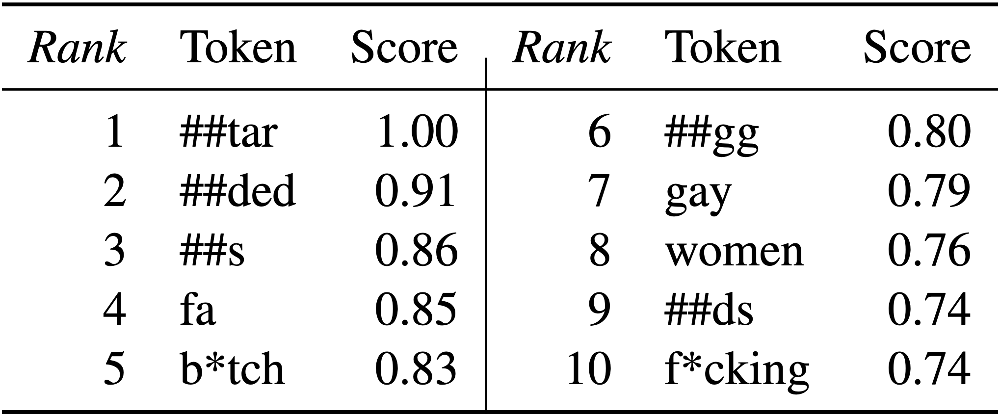

# :memo: Lexical artifacts statement

Lexical artifacts statement has been introduced in [Ramponi and Tonelli (NAACL 2022)](https://aclanthology.org/2022.naacl-main.221/) as a way to document potential lexical biases when a dataset is released, providing a complementary view to
data statements [(Bender and Friedman, TACL 2018)](https://aclanthology.org/Q18-1041/). In this page we present the template along with an example of lexical artifacts statement. 

We will include artifacts statement for several datasets across diverse tasks soon (keep an eye on this page!)

## Template

### I) Top lexical artifacts

Which are the *k* most informative tokens in the corpus for the class(es) of interest? This can be a ranked list of (*k* ≥ 10) tokens in plain text or in a tabular format, optionally along with associated scores. If there are multiple classes of interest, top *k* lexical artifacts for each class should be included.

### II) Class definitions

Different definitions for the same class may exist across datasets. This impacts the annotation, which in turn has an effect on resulting lexical artifacts. An explicit definition of the target class(es) for which the top lexical artifacts are computed should be provided here.

### III) Methods and resources

The method used to compute the correlation between tokens and class(es) (e.g., PMI, interpretability approaches) in the annotated corpus should be reported here, possibly with a link to code. If preprocessing and deduplication have been performed, they should be clearly reported. Resources such as full lists of lexical artifacts can be additionally included.

## Example

Lexical artifacts statement for the Reddit dataset (Vidgen et al., 2021) used in [Ramponi and Tonelli (NAACL 2022)](https://aclanthology.org/2022.naacl-main.221/).

### I) Top lexical artifacts

We present the top *k* = 10 most informative tokens for the **hateful** class along with their scores in Table 1.

<p align="center">
    
    <br/><b>Table 1</b>: <i>Top 10 most informative tokens for the hateful class on the Reddit dataset according to PMI.</i>
</p>

### II) Class definitions

The **hateful** class is represented by originally identity-directed labeled examples in CAD (Vidgen et al., 2021), and is defined as:

> *Content which contains a negative statement made against an identity. An 'identity' is a social category that relates to a fundamental aspect of individuals' community, socio-demographics, position or self-representation (...). It includes but is not limited to Religion, Race, Ethnicity, Gender, Sexuality, Nationality, Disability/Ableness and Class* (Vidgen et al., 2021).

### III) Methods and resources

**Association measure**. In order to compute the correlation between tokens to the hateful class we employ PMI as implemented in [Ramponi and Tonelli (NAACL 2022)](https://aclanthology.org/2022.naacl-main.221/) (code: https://github.com/dhfbk/hate-speech-artifacts). 

**Preprocessing and deduplication**. Input texts have been preprocessed by anonymizing user mentions, URLs, and email addresses with `[USER]`, `[URL]` and `[EMAIL]` placeholders. Hashtags have been segmented using [wordsegment](https://github.com/grantjenks/python-wordsegment), and we remove newlines, unescape HTML tags, and lowercase texts. Tokens are WordPieces given by the BERT tokenizer. Duplicate instances have been removed after preprocessing. 

**Resources**. The list of lexical artifacts along with associated scores is available at:
- [https://github.com/dhfbk/hate-speech-artifacts/artifacts-statement/ranked-artifacts/reddit_hateful-class.tsv](https://github.com/dhfbk/hate-speech-artifacts/blob/main/artifacts-statement/ranked-artifacts/reddit_hateful-class.tsv)


## Citation

If you use or build on top of this work, please cite our paper as follows:

```
@inproceedings{ramponi-tonelli-2022-features,
    title = "Features or Spurious Artifacts? Data-centric Baselines for Fair and Robust Hate Speech Detection",
    author = "Ramponi, Alan  and
      Tonelli, Sara",
    booktitle = "Proceedings of the 2022 Conference of the North American Chapter of the Association for Computational Linguistics: Human Language Technologies",
    month = jul,
    year = "2022",
    address = "Seattle, United States",
    publisher = "Association for Computational Linguistics",
    url = "https://aclanthology.org/2022.naacl-main.221",
    pages = "3027--3040",
}
```